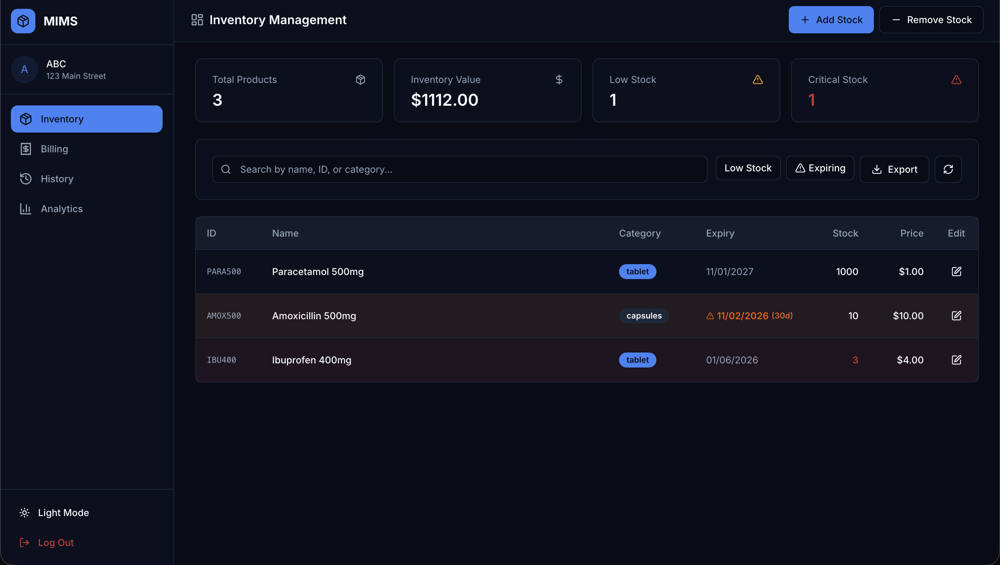
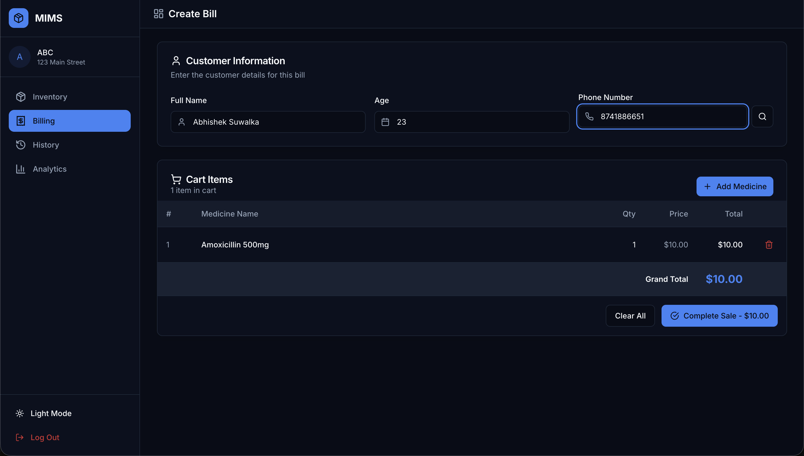
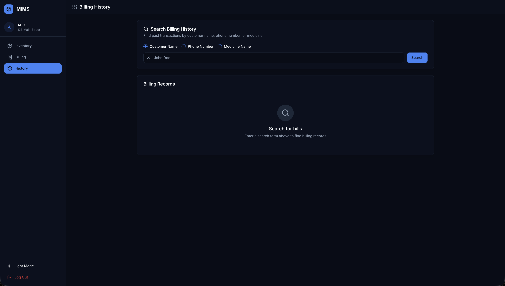

# MIMS

Full-stack inventory management system for pharmacies. Real-time stock tracking, sales analytics, and billing — built for stores managing thousands of products.

**[Live Demo](<LIVE_LINK>)**



---

## What It Does

**Stock Management** — Real-time inventory with low stock alerts, expiry tracking, and batch management. Dashboard shows total products, inventory value, and stock health instantly.

**Analytics** — Sales insights with flexible date ranges (daily/weekly/monthly/yearly). MongoDB aggregation pipelines handle large datasets efficiently. Server-side caching reduces load.

**Billing** — Cart persistence across sessions, customer lookup, automatic stock deduction with ACID transactions. Full history with search and CSV export.

---

## Tech Stack

| Layer | Technologies |
|-------|-------------|
| Frontend | React 18, TypeScript, Vite, Tailwind CSS, shadcn/ui, Recharts |
| Backend | Node.js, Express, JWT Auth, MongoDB Aggregation Pipelines |
| Database | MongoDB Atlas, Mongoose ODM |
| Infrastructure | Vercel (Serverless), CORS, Rate Limiting |

---

## Screenshots

| Inventory Management | Sales Analytics |
|----------------------|-----------------|
|  |  |

| Create Bill | Billing History |
|-------------|-----------------|
|  |  |

---

## Architecture

```
┌─────────────────────────────────────────────────────────────────┐
│                         Frontend (React)                         │
├─────────────────────────────────────────────────────────────────┤
│  Context API          │  Custom Hooks        │  UI Components   │
│  - AuthContext        │  - useDebounce       │  - shadcn/ui     │
│  - StockRefreshContext│  - useBackendStatus  │  - Recharts      │
├─────────────────────────────────────────────────────────────────┤
│                    Services & Utilities                          │
│  - errorHandler.ts    │  - validation.ts     │  - exportService │
│  - cartPersistence.ts │  - fetchWithErrorHandling               │
└─────────────────────────────────────────────────────────────────┘
                              │
                              ▼
┌─────────────────────────────────────────────────────────────────┐
│                      Backend (Express)                           │
├─────────────────────────────────────────────────────────────────┤
│  Middleware           │  Controllers         │  Services        │
│  - JWT Auth           │  - storeController   │  - storeService  │
│  - Rate Limiting      │  - analyticsController│ - analyticsService│
│  - Validation         │  - medicineController│  - customerService│
├─────────────────────────────────────────────────────────────────┤
│                    Data Layer                                    │
│  - MongoDB Aggregation Pipelines (no in-memory filtering)       │
│  - ACID Transactions for billing                                 │
│  - 5-minute TTL cache for analytics                             │
└─────────────────────────────────────────────────────────────────┘
```

---

## Key Implementation Details

**Performance at Scale**
- MongoDB aggregation pipelines process analytics server-side
- In-memory cache with 5-minute TTL reduces database load
- AbortController cancels stale requests on the frontend
- Chart data point limits (24 hourly / 31 daily / 12 monthly)

**Data Integrity**
- Mongoose transactions ensure billing + stock updates are atomic
- Optimistic UI updates with rollback on failure
- Input validation on both client and server

**Security**
- JWT tokens with 7-day expiry
- Rate limiting (10 req/min on auth routes)
- Security headers (X-Frame-Options, X-XSS-Protection)
- Password hashing with bcrypt (12 rounds)

**Developer Experience**
- Structured logging with request IDs
- Standardized API responses
- TypeScript on frontend, JSDoc on backend
- Service layer separation (controllers → services)

---

## Quick Start

```bash
# Clone
git clone https://github.com/Abhisheksuwalka/MIMS.git
cd MIMS

# Backend
cd backend_mongodb
npm install
cp .env.example .env  # Add MONGODB_URI and JWT_SECRET
npm run dev

# Frontend (new terminal)
cd ../VITE_frontend
npm install
cp .env.example .env  # Add VITE_API_URL=http://localhost:3000
npm run dev
```

Open http://localhost:5173

---

## API Reference

All routes except `/store/signup` and `/store/login` require `Authorization: <token>` header.

```
Authentication
POST /store/signup              Create account
POST /store/login               Get JWT token
POST /store/logout              Invalidate session

Stock Management
POST /store/api/stock           Query stock (with search)
POST /store/api/addstock        Add medicine to inventory
POST /store/api/removestock     Remove from inventory
POST /store/api/updatestock     Update price/quantity/expiry

Billing
POST /store/api/billing         Create bill (with transaction)
POST /store/api/billbyname      Search by customer name
POST /store/api/billbyphone     Search by phone
POST /store/api/billbymed       Search by medicine

Analytics
POST /store/analytics/sales     Sales data with date range
POST /store/analytics/top-selling   Top selling medicines

Customers
POST /store/customers/lookup    Find returning customer
GET  /store/alerts/low-stock    Get low stock alerts
```

---

## Environment Variables

**Backend** (`backend_mongodb/.env`)
```env
MONGODB_URI=mongodb+srv://...
JWT_SECRET=your-secret-key
PORT=3000
NODE_ENV=development
```

**Frontend** (`VITE_frontend/.env`)
```env
VITE_API_URL=http://localhost:3000
```

---

## Deployment

Both frontend and backend are deployed to Vercel as serverless functions.


---

## Author

**Abhishek Suwalka**

[](https://linkedin.com/in/abhisheksuwalka)
[](https://github.com/Abhisheksuwalka)

---

## License

MIT
